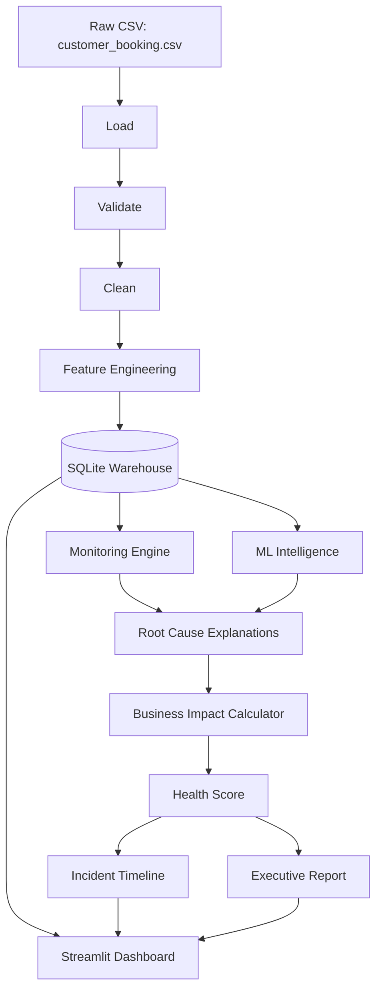
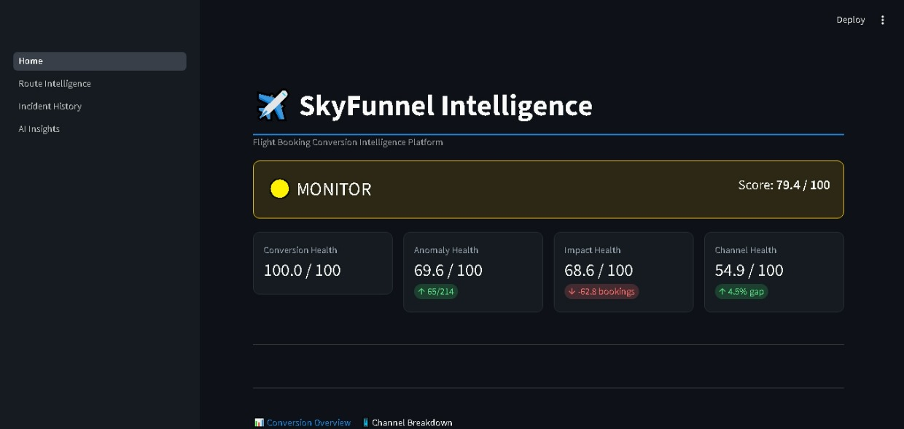
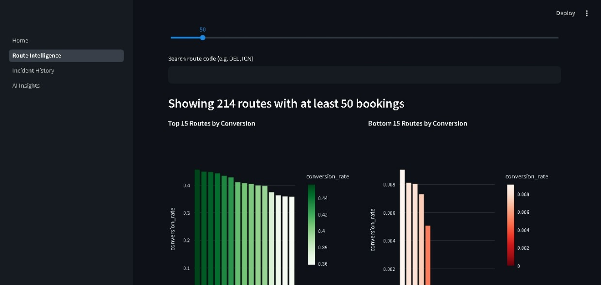
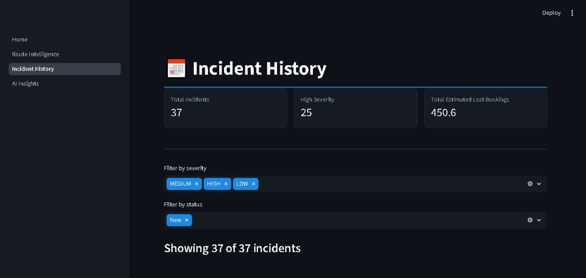
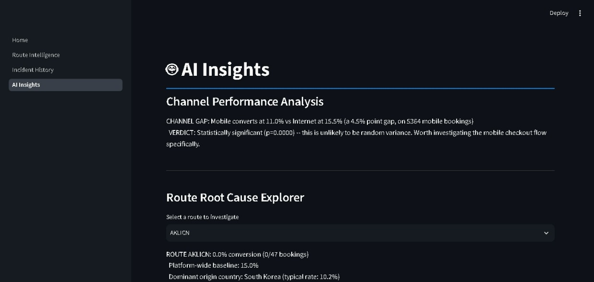

# ✈️ SkyFunnel Intelligence

**A Flight Booking Conversion Intelligence Platform** — detects, quantifies, and explains why customers abandon the booking funnel, using real-world flight booking data.

## The Problem

Only **15%** of customers who start a flight booking actually complete it. This project builds an end-to-end data intelligence platform — in the style of what airlines and travel platforms use internally — to monitor that conversion funnel, statistically detect genuine anomalies, and explain their business impact automatically.

## Key Findings

- Identified **37 routes** with statistically significant conversion drops vs. their origin country's baseline (binomial significance testing, p < 0.05)
- Quantified **~63 estimated lost bookings** across those routes
- Found Mobile converts **4.5 points lower** than Internet (statistically significant, p < 0.0001)
- Built a supervised Random Forest model (ROC AUC 0.76) showing booking origin country — not channel or trip type — is the dominant predictor of conversion
- Composite **Booking Health Score** (0-100) combining conversion, anomaly rate, business impact, and channel performance

## Architecture

## Tech Stack

Python · Pandas · NumPy · SQLAlchemy · SQLite · Scikit-learn · SciPy · Streamlit · Plotly

## Project Structure
SkyFunnel-Intelligence/
├── data/
│ ├── raw/ # Original untouched dataset
│ └── processed/ # Cleaned & feature-engineered data
├── database/ # SQLAlchemy models, SQLite warehouse
├── pipeline/ # ETL: load, validate, clean, feature-engineer, warehouse-load
├── monitoring/ # Conversion/funnel KPI queries
├── intelligence/ # ML models, significance testing, anomaly detection, root cause, health score
├── reports/ # Auto-generated executive reports
├── dashboard/ # Streamlit multi-page app
├── requirements.txt
└── README.md
## Running This Project

git clone https://github.com/Sakthi-2027/SkyFunnel-Intelligence.git
cd SkyFunnel-Intelligence
python -m venv venv
.\venv\Scripts\activate
pip install -r requirements.txt

python pipeline/load_data.py
python pipeline/validate_data.py
python pipeline/clean_data.py
python pipeline/feature_engineering.py
python -m pipeline.load_to_warehouse
python -m intelligence.incident_timeline

streamlit run dashboard/Home.py

## Screenshots

### Home — Booking Health Score

### Route Intelligence

### Incident History

### AI Insights

## Known Limitations

- **Static dataset, not live data**: this project uses one historical snapshot, not a streaming daily feed. All "estimated lost bookings" figures describe totals across whatever period this dataset spans — they are not a daily or ongoing rate.
- **Multiple comparisons**: 214 routes were significance-tested independently at p < 0.05. At that sample size, roughly 5% (~11 routes) would appear "significant" by pure chance even if nothing were wrong anywhere. The 65 flagged routes are well above that chance floor, suggesting real signal, but a production version of this system would apply a correction (e.g. Bonferroni) rather than treat all flagged routes as equally certain.
- **Isolation Forest was tried and found unsuitable**: since `booking_complete` is a labeled target, unsupervised anomaly detection consistently surfaced statistically rare but business-irrelevant combinations (e.g. long-haul flight durations) rather than conversion-relevant anomalies. The supervised Random Forest model was a better fit for this specific dataset — documented here as a deliberate finding, not an oversight.
- **No revenue/pricing data**: the original project scope included revenue and pricing monitoring; this dataset has no price or revenue columns, so those modules were scoped out rather than simulated.

## Author

Built by Sakthi S as an end-to-end data engineering, analytics, and ML project.